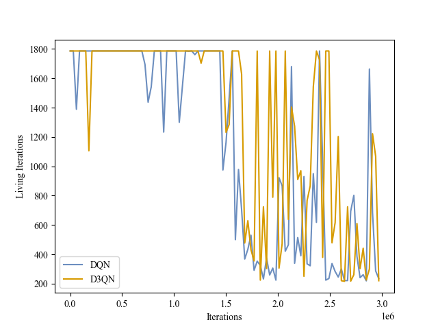
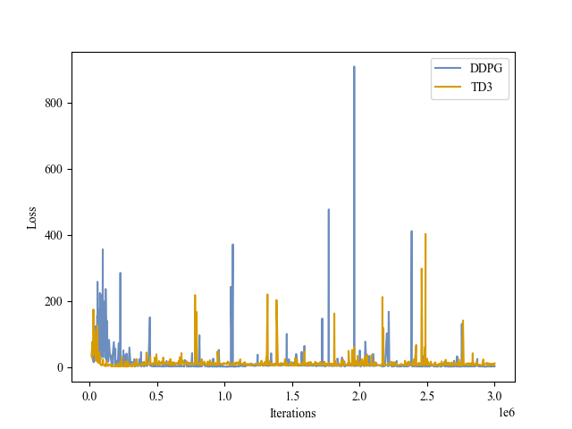

# RLDemo
Two kinds of model-free Reinforcement Learning methods, value-based RL and policy-based RL, are implemented respectively to solve two kinds of environments, with discrete action space or continuous action space. Each kind of method is implemented with a basic and popular algorithm and its corresponding representative improvement. And each kind of environment is tested with four different instances. Specifically, [**Deep Q-Network**](https://arxiv.org/abs/1312.5602) ([**DQN**](https://www.nature.com/articles/nature14236)) with [**Dueling Double DQN**](https://arxiv.org/abs/1511.06581) ([**D3QN**](https://arxiv.org/abs/1509.06461)) and [**Deep Deterministic Policy Gradient**](https://arxiv.org/abs/1509.02971) (**DDPG**) with [**Twin Delayed DDPG**](https://arxiv.org/abs/1802.09477) (**TD3**) are re-implemented in [**PyTorch**](https://arxiv.org/abs/1912.01703) on [**OpenAI Gym**](https://arxiv.org/abs/1606.01540)'s [**Atari**](https://arxiv.org/abs/1207.4708) (`PongNoFrameskip-v4`, `BoxingNoFrameskip-v4`, `BreakoutNoFrameskip-v4`, `VideoPinball-ramNoFrameskip-v4`) and [**MuJoCo**](https://ieeexplore.ieee.org/document/6386109) (`Hopper-v2`, `HalfCheetah-v2`, `Ant-v2`, `Humanoid-v2`), not strictly compared with [**OpenAI Baselines**](https://github.com/openai/baselines), [**Dopamine**](https://github.com/google/dopamine), [**Spinning Up**](https://github.com/openai/spinningup) and [**Tianshou**](https://github.com/thu-ml/tianshou).


## Demos
||Pong|Boxing|Breakout|Pinball|
|:-:|:-:|:-:|:-:|:-:|
|DQN|||||
|D3QN|||||

||Hopper|HalfCheetah|Ant|Humanoid|
|:-:|:-:|:-:|:-:|:-:|
|DDPG|||||
|TD3|||||

## Dependencies
Main: python3.8, gym0.26.2, mujoco2.1.0.
```bash
# create conda environment
conda create -n rl python=3.8
conda activate rl
# install gym
pip install gym==0.26.2
# install gym[atari]
pip install gym[atari]
pip install gym[accept-rom-license]
# install gym[mujoco]
pip install gym[mujoco]
wget https://mujoco.org/download/mujoco210-linux-x86_64.tar.gz
tar -zxvf mujoco210-linux-x86_64.tar.gz
mkdir ~/.mujoco
mv mujoco210 ~/.mujoco/mujoco210
rm mujoco210-linux-x86_64.tar.gz
pip install -U 'mujoco-py<2.2,>=2.1'
sudo apt install libosmesa6-dev libgl1-mesa-glx libglfw3
pip install Cython==3.0.0a10
# install other dependencies
pip install tqdm
pip install numpy
pip install torch==1.13.1+cu117 --extra-index-url https://download.pytorch.org/whl/cu117
pip install tensorboard
pip install opencv-python
pip install einops
```

## Get Started
```bash
python run.py --env_name [env_name] [--improve] [--test] --seed [seed] --device [device] [--debug] [--gui] [--video]
```

## Results
> Full results refer to `outputs`. Note that the hyperparameters of the algorithms vary across different implementations. Also, the metric used is not strictly the same (e.g. average testing score with 10 trials is used in RLDemo, while Tianshou uses the max average validation score in the last training 1M/10M timesteps). In addition, other popular implementations have no individual D3QN implementation, so Rainbow instead is selected for the D3QN's performance. Besides, other popular implementations have no individual results for the RAM version of Pinball environment, so its normal image version is selected.

|DQN|Pong|Boxing|Breakout|Pinball|
|:-:|:-:|:-:|:-:|:-:|
|OpenAI Baselines|16.5|-|**131.5**|-|
|Dopamine|9.8|\~77|92.2|**\~65000**|
|Tianshou|20.2|-|**133.5**|-|
|RLDemo|**21.0**|**95.4**|9.6|6250.0|

|D3QN/Rainbow|Pong|Boxing|Breakout|Pinball|
|:-:|:-:|:-:|:-:|:-:|
|OpenAI Baselines|-|-|-|-|
|Dopamine|19.1|**~99**|47.9|**\~465000**|
|Tianshou|20.2|-|**440.4**|-|
|RLDemo|**21.0**|84.6|6.2|4376.6|

|DDPG|Hopper|HalfCheetah|Ant|Humanoid|
|:-:|:-:|:-:|:-:|:-:|
|Spinning Up|\~1800|**\~11000**|\~840|-|
|Tianshou|2197.0|**11718.7**|990.4|177.3|
|RLDemo|**3289.2**|8720.5|**2685.3**|**2401.4**|

|TD3|Hopper|HalfCheetah|Ant|Humanoid|
|:-:|:-:|:-:|:-:|:-:|
|Spinning Up|\~2860|\~9750|\~3800|-|
|Tianshou|**3472.2**|10201.2|**5116.4**|**5189.5**|
|RLDemo|1205.3|**12254.4**|**5058.1**|**5206.4**|

||Pong|Boxing|Breakout|Pinball|
|:-:|:-:|:-:|:-:|:-:|
|Loss|||||
|Validation Score|||||
|Validation Return|||||
|Validation Iterations|||||

||Hopper|HalfCheetah|Ant|Humanoid|
|:-:|:-:|:-:|:-:|:-:|
|Actor Loss|||||
|Critic Loss|||||
|Validation Score|||||
|Validation Return|||||
|Validation Iterations|||||
